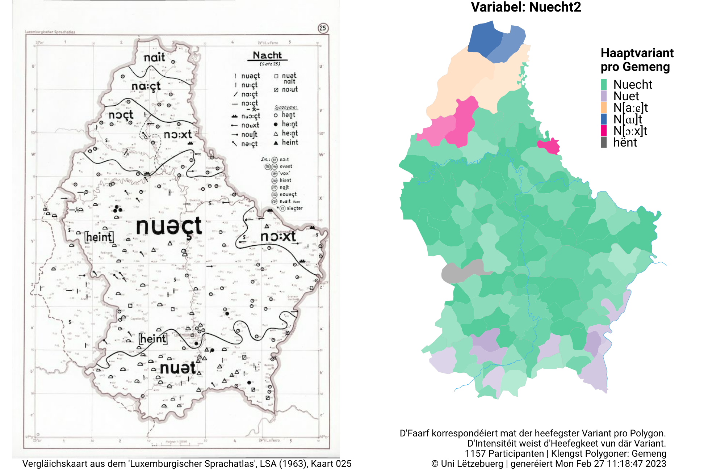

# Wëllkomm beim *Variatiounsatlas vum Lëtzebuergeschen*

An dësem Atlas fannt Dir déi éischt Kaarten aus eisem [Schnëssen-Projet](https://infolux.uni.lu/schnëssen). Pro Kaart sinn d'Opname vu 500 bis 2000 Leit verschafft an domat kritt een eng zimmlech zouverlässeg Impressioun vun der haiteger Variatioun am Lëtzebuergeschen. Gläichzäiteg kann een un de Kaarten a Visualiséierungen ofliesen, wéi staark d'Lëtzebuergescht am Moment amgaang ass sech ze veränneren.

An dëser éischter Editioun hu mir ca. **700** verschidde Kaarten ausgewielt.

Iwwer de Menüpunkt 'Kaarten' lénks kënne déi eenzel Kaartekomplexer ausgewielt ginn.

D'Verbreedung am Land gëtt a verschiddene Kaarten illustréiert. Eng Iwwerbléckskaart weist déi heefegst Variant pro Gemeng. Donieft ginn d'Variantekaarte méi an den Detail an illustréieren déi genee Verbreedung vun enger Variant (relativ zur Gesamtzuel vun den Opname pro Gemeng). Deelweis gëtt och eng al Kaart aus dem 'Luxemburgischer Sprachatlas' vun 1963 als Verglach gewisen, fir d'Verännerung vun der Dialektlandschaft ze visualiséieren.

Donieft fannt Dir Grafike fir d'Verdeelung par rapport zu Alter, Geschlecht, Dialektgebitt, Ausbildung, Sproochkompetenz am Däitschen, Sproochkompetenz am Franséischen. D'Zuelen an de Segmenter ginn un, wéi vill Participante\*Participanteën an där Katgorie dës Variant gesot hunn.

Iwwer 'Audio' kann een all eenzel Audioopnam lauschteren.

D'Auswäertung ass ëmmer nach amgaang an no an no wäerte sech déi eventuell wäiss Plazen op verschiddene Kaarten nach fëllen.

Um Handy leeft dëse Site nach net optimal.
