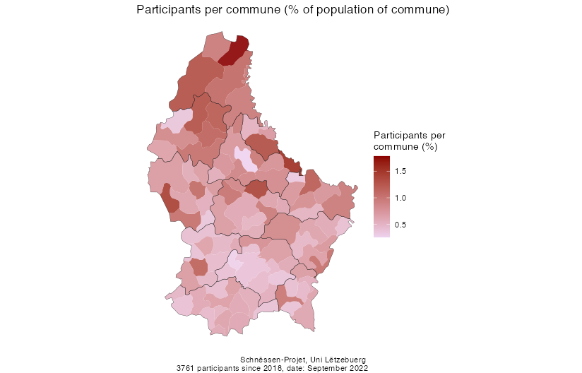

# Opbau vum Variatiounsatlas

## Struktur vun der Datebasis

Iwwerbléck iwwert d'Datebasis, déi via *Crowd-sourcing* mat der Schnëssen-App opgehuewe ginn ass. D'Grafike ginn automatesch aktualiséiert, esoubal weider Daten dobäikommen.

### Opname pro Ronn

### Participantë pro Schnëssen-Item

### Participantë pro Gemeng

### Altersverdeelung

*Just Participanten, déi op d'mannst 5 Opname realiséiert hunn*

### Verdeelung no Geschlecht

### Verdeelung no Ausbildung

### Verdeelung no Mammesprooch

### Verdeelung no Dialektgebiet

